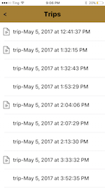
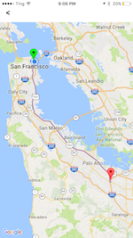

# SmartCam

### App Icon: 

### App Images: 
                    

### Purpose: 
Help the user to keep a record of sudden, unexpected events on road.

### Core Features
+ User does not need to create an account to use the app.
+ Creates and saves a video file with few seconds before and after any event that happens.
+ Saves the GPS coordinates, timestamp, speed and other data for the whole trip. 
+ User is able to playback all the recorded events from all his trips and view other metrics also for all his trips. 

### Technologies Used
+ iOS frameworks 
    - For video recoding and playback - AVFoundation, AVKit, Photos
    - For location tracking - Core Location
+ Third party APIs/SDKs - Google Maps SDK, Firebase Database

### Additional Features To Be Implemented
+ Ability to save multiple events on a trip.
+ Display event location on map.
+ Video playback on full screen.
+ Memory efficient way of saving an event.
+ Recognize motion of vehicle to start and stop video recording, and sudden braking or other sudden actions by driver to save events.
